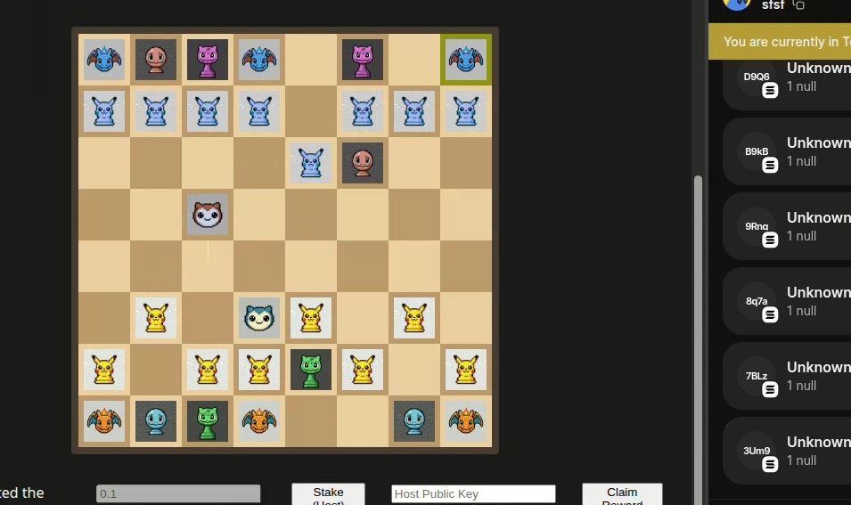

# PokeChess

> **Chess met Pokémon on the Solana Blockchain.**




## 🧠 PokeChess Architecture


PokeChess is a fully decentralized, on-chain chess game that reimagines the classic strategy game with Pokémon pieces. Built on the **Solana** blockchain using the **Anchor** framework, it ensures every move is verifiable, immutable, and truly owned by the players.

---

## 🎮 How It Works (Project Structure)

This project is a **Monorepo** bridging a high-performance Rust backend with a modern React frontend.

### 1. The Brain: Anchor Program (Rust)
Located in `programs/pokechess`.
*   **The Engine**: Acts as the authoritative game server. It validates legal chess moves, handles check/checkmate logic, and manages game state.
*   **Trustless**: Unlike a traditional server, the "rules" are deployed on-chain. No admin can cheat or revert a move.
*   **State Management**: Stores the board configuration (8x8 grid), player turns, and staking info in Solana Accounts.

### 2. The Face: Frontend (React)
Located in `frontend/`.
*   **User Interface**: A beautiful, dark-mode chess board where pieces are 8-bit Pokémon sprites (Pickachu as Pawns, Snorlax as King, etc.).
*   **Wallet Adapter**: Connects to the user's Phantom/Solflare wallet to sign transactions.
*   **Interaction**: transforming a user's drag-and-drop action into an RPC call to the Solana blockchain.

### 3. The Bridge: TypeScript Tests
Located in `tests/`.
*   Simulates game scenarios to ensure the Rust program behaves exactly as expected before deployment.

---

## 🕹️ User Story: The Journey

1.  **Connect**: The player lands on the site and connects their Solana Wallet (e.g., Phantom).
2.  **Stake & Start**: The player initializes a game, optionally staking SOL constraints to make the match interesting.
3.  **Play**:
    *   Player A moves a **Pikachu (Pawn)**.
    *   The frontend sends a transaction to the **Anchor Program**.
    *   The Program verifies the move is valid and updates the on-chain board.
    *   The UI updates in real-time for Player B.
4.  **Win**: Checkmate your opponent's **Snorlax (King)** to win the game and claim the staked SOL pot!

---

## 🚀 Getting Started

### Prerequisites
*   Rust & Cargo
*   Solana Tool Suite
*   Node.js & Yarn
*   Anchor Framework

### Installation

1.  **Clone the Repo**
    ```bash
    git clone https://github.com/Harshbhargav45/poke-chess.git
    cd poke-chess
    ```

2.  **Install Dependencies**
    ```bash
    yarn install
    ```

3.  **Build the Program**
    ```bash
    anchor build
    ```

4.  **Run Tests**
    ```bash
    anchor test
    ```

5.  **Start Frontend** (if applicable)
    ```bash
    cd frontend
    yarn dev
    ```

---

## 🛡️ Security & Privacy

*   **Non-Custodial**: You retain full control of your private keys.
*   **Open Source**: Verify the code yourself. The program ID and source availability ensures transparency.
*   **Git Ignored**: Sensitive keys (`*.json`) and environment variables (`.env`) are strictly excluded from the repository.

---

## 📜 License

This project is licensed under the MIT License.
