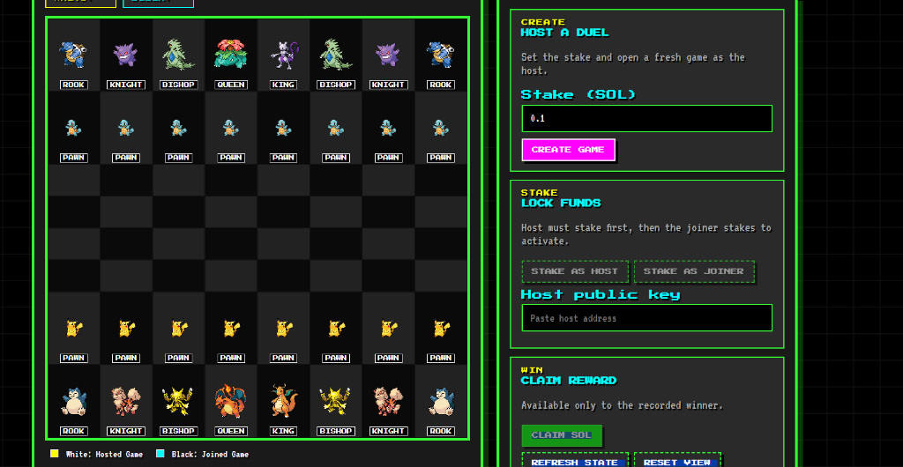

# PokeChess

On-chain, Pokémon-flavored classical 32-piece chess built with **Solana + Anchor** and a **React/Vite** client.



## Features

- **Full 32-Piece Chess Implementation:** Classic movement, captures, and turn mechanics natively written in Rust validation logic on Solana.
- **MagicBlock Ephemeral Rollups:** Toggle sub-second transactions locally out of the box for instantaneous blazingly fast chess mechanics without the latency of normal L1 execution.
- **Socket.IO Real-time Lobby:** Automatically discover matches and peers looking for open games in a dynamic dashboard.
- **Strict TypeScript Types:** Complete strictly-typed web3 hooks natively mapping exact IDLs.
- **Futuristic Dark UI:** Glow grids, floating animated sprites, and highly responsive feedback bounds.

## Piece Alignments

The classic chess pieces have been uniquely mapped to Pokémon for both sides:

| Piece | White | Black |
| :--- | :--- | :--- |
| **King** | Dragonite | Mewtwo |
| **Queen** | Charizard | Venusaur |
| **Rook** | Snorlax | Blastoise |
| **Bishop** | Alakazam | Tyranitar |
| **Knight** | Arcanine | Gengar |
| **Pawn** | Pikachu | Squirtle |

## Structure

- `programs/pokechess` – Anchor program (Rust). Handles 32-piece setup, turn enforcement, bounds validation, captures, checks, staking, and payouts.
- `frontend/` – **TypeScript** React client with Solana Wallet Adapter, on-chain polling, and MagicBlock RPC connect.
- `backend/` – Socket.IO lobby server for public peer matchmaking.
- `tests/` – TypeScript tests driven by Anchor to exercise the full lifecycle.
- `assets/` – Shared imagery.

## Quick start

```bash
# install all deps
yarn install

# build & test program (needs solana + anchor CLI)
anchor build
anchor test

# start the socket.io peer discovery backend on port 8787
cd backend && yarn install && yarn dev

# in a separate terminal: run the frontend UI 
cd frontend && yarn install && yarn dev
```

## How the duel works

1) Host creates a game, setting an initial stake (SOL).  
2) Host stakes → status moves to “waiting for opponent” and broadcasted to the socket.io Lobby.
3) Opponent clicks your open lobby slot, clicks Join and also stakes → game active!
4) Players take alternating turns moving up to 16 pieces, verified live.
5) Capture the enemy's King (Dragonite or Mewtwo). Winner claims the SOL vault!

## License

MIT
